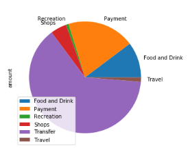

# Summary

## Budget
More than 50% spent is for tranfers. Second is for payments for such expenses. Pie Chart shows spend by category. By this budget spend, it will lead into major debt is the short to long term.

Spending per month shows a steady spend through out the months.

* Spending Categories Pie Chart

  

* Spending Per Month Bar Chart

  

- - -

## Retirement

Monte Carlo simulations provide a general view of an invesment of $20,000 with our portfolio of 2 stock over the next 30 years. 

